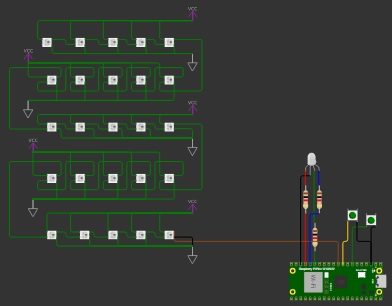

# Projeto: Controle de Matriz de LEDs com Raspberry Pi Pico

## 📌 Descrição
Este projeto utiliza um Raspberry Pi Pico para controlar uma matriz de 25 LEDs WS2812B. O código gerencia a exibição de padrões na matriz e inclui a configuração de botões para alternar os padrões de exibição. Além disso, há um LED vermelho separado que pisca a cada 100 ms.

Link de Youtube apresentando o funcionamento do projeto: https://youtu.be/oF3cpTAA-Kk

## 🛠️ Tecnologias Utilizadas
- **Linguagem:** C
- **Hardware:** Raspberry Pi Pico
- **Bibliotecas:**
  - `pico/stdlib.h` → Entrada e saída padrão
  - `hardware/pio.h` → Controle de periféricos PIO
  - `hardware/gpio.h` → Manipulação de GPIO
  - `hardware/timer.h` → Temporizador de hardware
  - `Interrupto.pio.h` → Controle dos LEDs WS2812B
  - `numeros.h` → Definição de padrões de exibição dos números de 0 até 9

## ⚙️ Funcionalidades
- Controle de uma matriz de 5x5 LEDs endereçáveis WS2812B
- Alternância entre padrões predefinidos através de botões
- Debounce para evitar múltiplas leituras acidentais dos botões
- Piscar automático de um LED vermelho separado
- Uso de PIO (Programmed Input/Output) para controle eficiente dos LEDs

## 🎛️ Hardware Necessário
- Placa de desenvolvimento BitDogLab

  ou pode ser montado usando:
- **Raspberry Pi Pico W**
- **Matriz de LEDs WS2812B (5x5 ou equivalente)**
- **Botões de pressão** (2 unidades)
- **LED vermelho** (opcional, pode ser substituído por outro componente visual)
- **Resistores e fiação para conexão**

## 🔌 Ligações
| Componente | Pino do Pico |
|------------|--------------|
| Matriz de LEDs WS2812B | GPIO7 |
| LED Vermelho | GPIO13 |
| Botão A | GPIO5 |
| Botão B | GPIO6 |

## 📝 Estrutura do Código
### 📂 Bibliotecas e Definições
- Importa as bibliotecas necessárias
- Define constantes como número de LEDs, pinos de controle e debounce

### ⚡ Configuração do Hardware
- Inicializa os pinos de LEDs e botões
- Configura as interrupções para detectar os botões
- Inicializa o periférico PIO para controle da matriz

### 🔄 Loop Principal
- Mantém o código em execução contínua
- O temporizador alterna o estado do LED vermelho
- As interrupções dos botões atualizam o padrão dos LEDs

## ▶️ Como Instalar
1. Clone este repositório:
   
        git clone https://github.com/JoseBrunoSouza/Subgrupo-7.git
2. Compile o código::

       No SDK do VS code aperte em compilar segundo imagem
   
   
   
3. Com a placa BitDogLab conectada no computador em modo Bootsel envie o arquivo `.uf2` gerado

4. Esquema de conexões caso não tenha a placa BitDogLab
   
   
5. **Pressione os botões** para alternar os padrões exibidos na matriz.

## 🚀 Melhorias Futuras
- Adicionar novos padrões de animação
- Implementar controle de brilho para os LEDs
- Expandir a matriz para suportar mais LEDs

---
📌 **Desenvolvido por:** [Anibal Maldonado](https://github.com/PhD-Anibal)
